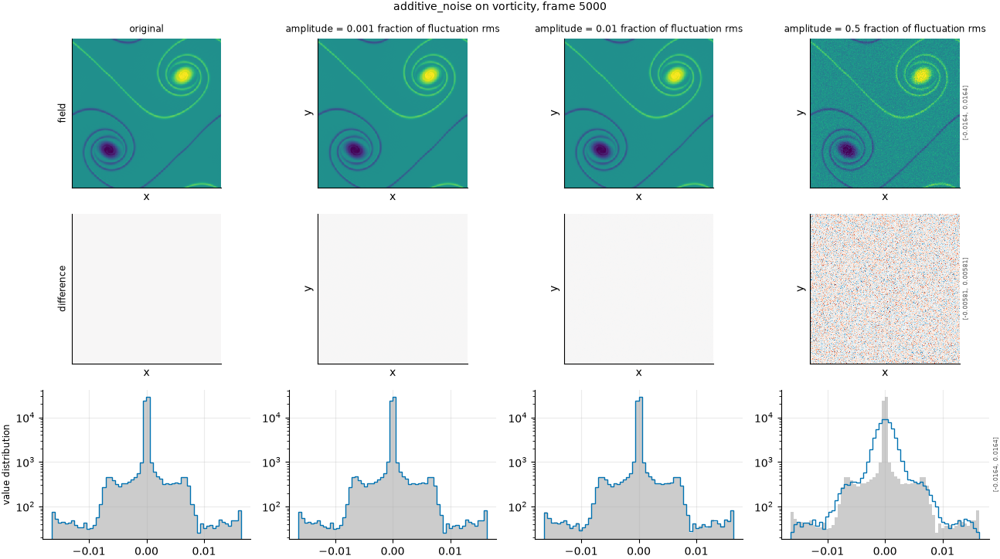

## Definition

Independent Gaussian noise is added to every cell and channel:

$$
g(x) = f(x) + a\,\sigma_{f}\, \eta(x), \qquad \eta \sim \mathcal{N}(0, 1) \tag{1}
$$

where $\sigma_f$ is the RMS of the *reference field's fluctuation* about its spatial mean
and $a$ is the configured amplitude. Draws are independent between cells, channels and
frames.

The generator is seeded from the run seed together with the variant label, the frame index
and the field name, so the same run reproduces exactly and the result does not depend on
the order in which metrics, fields or frames are evaluated.

### Boundary handling

None. Each cell is perturbed independently and no neighbourhood is consulted, so
there is no boundary to treat.

## Intuition

This stands in for a surrogate whose error is random and uncorrelated between
neighbouring cells: an under-trained model, a stochastic method with too few realisations,
or measurement noise in data assimilation.

It is the most easily detected degradation in the default set, and that is its value. Any
metric worth having responds strongly and monotonically to noise, so a metric that does
*not* is broken in an obvious way. It is the sanity check of the suite rather than a
discriminating test.

In a picture, noise is grain: the shapes remain but the surface becomes speckled, and at
large amplitudes the field disappears into static.

```
before                 after (amplitude 0.5 of the fluctuation)
0 0 0 0                 0.06 -0.07  0.32  0.05
0 1 1 0                -0.27  1.18  1.65  0.47
0 1 1 0                -0.35  0.37  0.69  0.02
0 0 0 0                -1.16 -0.11 -0.62 -0.37
```

Every cell has moved, including the ones that were zero, and neighbouring cells have moved
independently -- there is no pattern in the perturbation. The spatial mean shifts slightly,
by an amount that averages to zero over many draws but is not zero for any single one.

What this degradation leaves untouched is position: no structure moves, and the underlying
field is still exactly where it was, buried under the grain.

## Severity scale

The severity is the noise standard deviation as a fraction of the reference field's
fluctuation RMS, measured per field and per frame. An amplitude of 0.1 means noise one
tenth the size of the field's own variation, which makes the number directly comparable
between fields whose magnitudes differ by orders of magnitude.

Normalising against the *fluctuation* rather than the raw RMS matters for the same reason
it does in NRMSE: the density field sits at 1.0 with variations of order 1e-4, so noise
scaled to the raw RMS would obliterate it.

The strengths run at 0.001, 0.01, 0.1 and 0.5 -- three orders of magnitude, chosen wide
because every metric responds here and the interesting question is how early rather than
how strongly.

## Limitations

White noise is the least realistic failure in the default set. A real surrogate's errors
are strongly correlated in space, because the model producing them is smooth; uncorrelated
per-cell error is what almost no model actually does. A metric that detects this
degradation well has been shown very little.

It is also the degradation most likely to flatter a metric. Noise adds energy at every
wavenumber, including the highest, where the reference has least -- so any metric with
sensitivity to small scales registers it immediately. Strong performance here should not
be read across to the smoothing degradations, which are the harder version of the same
question.

Because it is stochastic, a single draw at a low amplitude carries real sampling
variation, and the response at the weakest level is noisier than on the deterministic
degradations.

## What the degradation looks like

### The picture

<!-- GENERATED exemplars: written by `python -m fmeval.cards exemplars additive_noise`, do not edit -->



**additive_noise** on vorticity, frame 5000 of `kinet_re5e4`. A thousandth of the fluctuation is far below what any eye can see; a half is comparable to the field's own variation. The pdf row is the row that shows the mechanism, since noise broadens the distribution of values without moving anything, and the difference row confirms the error is uncorrelated between neighbouring cells rather than structured.

| configured | applied | difference RMS | power retained |
|---|---|---|---|
| 0.001 | 0.001 | 2.565e-06 | -- |
| 0.01 | 0.01 | 2.567e-05 | -- |
| 0.5 | 0.5 | 0.001289 | -- |

<!-- END GENERATED exemplars -->

The field row tells the story at the strong end and nothing at the weak end, and the pdf
row does not rescue it: at an amplitude of 0.001 the distribution's width moves from
0.002573 to 0.002573, and at 0.01 to 0.002574. Noise adds in quadrature, so an amplitude
of a hundredth changes the width by five parts in a hundred thousand. Only at 0.5 does it
become visible, at 0.002873.

That is worth knowing before reading a metric's response: the two weakest levels of this
degradation are invisible in every panel here, so a metric that separates them is not
agreeing with the eye but exceeding it.

In the difference row, look for the absence of structure. Every other degradation in this
gallery produces a difference concentrated somewhere -- at edges, at particular scales, in
particular regions. This one produces difference everywhere with no pattern at all, and
that contrast is worth carrying to the other panels.

## References

\bibliography
