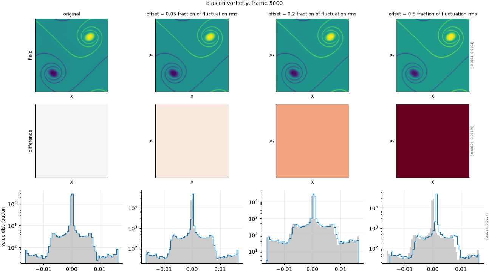

## Definition

A constant is added to every cell:

$$
g(x) = f(x) + b\,\sigma_{f} \tag{1}
$$

where $\sigma_f$ is the RMS of the reference field's fluctuation about its spatial mean
and $b$ is the configured offset. The perturbation is the same everywhere, so every
spatial derivative, every difference between cells, and the entire spectrum above
$k = 0$ are untouched. Only the $k = 0$ mode changes.

### Boundary handling

None. Every cell receives the same constant and no neighbourhood is consulted.

## Intuition

This stands in for a surrogate with a systematic offset: a drifting mean, a
miscalibrated boundary condition, or a conserved quantity that is quietly leaking. The
prediction has every structure right, in the right place, at the right strength, and the
whole field sits at the wrong level.

It is the purest possible test of one specific question: does this metric care about the
mean? Some should and some should not, and the answer is a design decision rather than a
defect. A metric intended to judge structure should ideally ignore a constant offset; a
metric intended to check conservation must not.

```
before                 after (offset 0.5 of the fluctuation)
0 0 0 0                0.5 0.5 0.5 0.5
0 1 1 0                0.5 1.5 1.5 0.5
0 1 1 0                0.5 1.5 1.5 0.5
0 0 0 0                0.5 0.5 0.5 0.5
```

Every value has moved by exactly the same amount. The mean rises from 0.25 to 0.75 and
nothing else about the field has changed at all.

What it leaves untouched is everything except the mean: every gradient, every contrast,
every structure and the entire spectrum above the zero mode.

## Severity scale

The severity is the offset as a fraction of the reference field's fluctuation RMS,
which is what makes it comparable between fields. On density, whose fluctuations are four
orders of magnitude below its mean, an offset stated in raw units would be meaningless;
stated as a fraction of the fluctuation it means the same thing there as on vorticity.

This axis is not in the default ladder at all -- it is registered and available but not
configured, because in the current panel every metric responds to it identically and it
separates none of them.

## Limitations

Not in the default ladder, so it will not appear in a run unless added.

The operator is a fair imitation of a mean drift and nothing else. Real conservation
failures are rarely uniform: a leaking quantity usually leaks from somewhere, producing a
spatial pattern this cannot represent.

Its interpretation also depends entirely on the field. A constant offset to vorticity adds
net circulation, which is physically meaningful and in a periodic domain impossible; a
constant offset to density is a mass change. The operator does not know or care, so the
damage it produces should be read as a metric's sensitivity to the mean rather than as a
physical error of a defined kind.

## Exemplars

### The panel

<!-- GENERATED exemplars: written by `python -m fmeval.cards exemplars bias`, do not edit -->



**bias** on vorticity, frame 5000 of `kinet_re5e4`. Three offsets spanning a small fraction of the field's variation to half of it. The pdf row shows the mechanism exactly -- the whole distribution slides without changing shape -- and the difference row shows a flat, featureless offset, which is unlike every other degradation in the gallery.

| configured | applied | difference RMS | power retained |
|---|---|---|---|
| 0.05 | 0.05 | 0.0001287 | -- |
| 0.2 | 0.2 | 0.0005147 | -- |
| 0.5 | 0.5 | 0.001287 | -- |

<!-- END GENERATED exemplars -->

The field row is the least informative panel in the gallery, and deliberately so: at
a shared colour scale the columns differ only in overall brightness, with no change in any
structure. That is the whole content of this degradation.

The difference row is flat -- a uniform sheet at the offset value, with no feature
anywhere. No other panel in this gallery looks like that, and the contrast is worth
carrying to the others.

In the pdf row the distribution slides bodily without changing shape or width. If it also
broadens or skews, the operator is doing something more than this card claims.

## References

\bibliography
