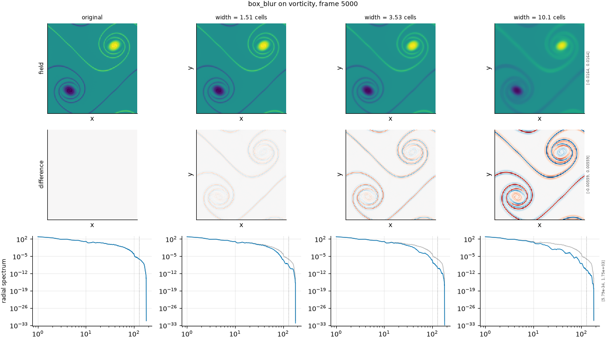

## Definition

Each cell is replaced by the unweighted mean of a square neighbourhood of odd width
$w$ cells,

$$
g(x) = \frac{1}{w^{d}} \sum_{|y_i| \le (w-1)/2} f(x - y) \tag{1}
$$

in $d$ spatial dimensions, applied to each channel independently. The weights are
positive and sum to one, so the spatial mean is preserved exactly.

In wavenumber space Equation (1) multiplies each mode by a product of Dirichlet kernels,
$\prod_i \mathrm{sinc}(w k_i / 2) / \mathrm{sinc}(k_i / 2)$, which is not monotone: it
crosses zero and changes sign, so some wavenumbers are annihilated and others are
returned with inverted phase. This is the property that distinguishes the box from the
Gaussian, and the reason both are in the default set.

### Boundary handling

Periodic wrap. The window takes its neighbours from the opposite edge rather than
padding or shrinking near the boundary.

## Intuition

This stands in for a surrogate whose effective resolution is coarser than the grid it
writes on -- the crudest form of losing the small scales. It is in the default set
alongside the Gaussian because the two remove roughly the same amount of structure by very
different means, and a metric that cannot tell them apart is only measuring how much
smoothing happened rather than what kind.

Applied to a picture, a box kernel produces a characteristic blockiness that a Gaussian
does not: features acquire square haloes aligned with the grid, because the kernel itself
is square and has hard edges.

```
before                 after (width = 3 cells)
0 0 0 0                0.11 0.22 0.22 0.11
0 1 1 0                0.22 0.44 0.44 0.22
0 1 1 0                0.22 0.44 0.44 0.22
0 0 0 0                0.11 0.22 0.22 0.11
```

What this degradation leaves untouched is the total. Like every kernel here it only
redistributes, preserving the mean exactly, and it moves nothing -- a feature stays where
it was and merely spreads.

## Severity scale

The severity is the window width in analysis-grid cells, given in the configuration
as a fraction of the field's characteristic scale and resolved per field.

The width is then rounded to an **odd** number of cells, and that rounding is not a
detail. A window of even width has no centre cell, so the filter places it
asymmetrically and displaces the field by half a cell. In a project whose central concern
is that metrics over-punish displacement, that artefact dominates: measured on vorticity,
calibrated widths rounding to 2, 3, 6 and 13 cells gave damages of 0.0121, 0.0041, 0.0338
and 0.0880 -- non-monotone, because the even level carried a half-cell shift the odd one
did not. Rounding to odd removes the artefact and the degradation becomes monotone.

The strengths run at fractions 0.06, 0.14, 0.25 and 0.40 of the characteristic scale,
spaced to clear the rounding on both fields.

## Limitations

The odd-width rounding that makes this degradation monotone also quantises it coarsely. On
a field with a characteristic scale of about 29 cells, two configured fractions closer
than roughly 0.06 resolve to the same width and produce the same experiment; a severity
level that collapses this way is detected and excluded rather than counted as agreement,
but it costs a level. On smoother fields the quantisation is finer and the same list gives
better-separated levels, so the degradation has different resolution on different fields.

As an imitation of a real surrogate this operator is the least faithful of the smoothing
kernels: nothing in a numerical scheme produces a hard square window, and the
sign-changing transfer function is an artefact of the shape rather than a physical effect.
Its purpose is discrimination between metrics, not realism.

## What the degradation looks like

### The picture

<!-- GENERATED exemplars: written by `python -m fmeval.cards exemplars box_blur`, do not edit -->



**box_blur** on vorticity, frame 5000 of `kinet_re5e4`. Weak is the narrowest width that clears the odd-cell rounding on both fields; strong reaches well into the energetic scales. The radial spectrum row is the one that matters here: unlike a Gaussian, a box kernel does not attenuate every scale, and the sidelobes it leaves are visible only in the spectrum.

| configured | applied | difference RMS | power retained |
|---|---|---|---|
| 0.06 | 1.511 | 0.0002845 | 0.9896 |
| 0.14 | 3.526 | 0.0006248 | 0.9746 |
| 0.4 | 10.07 | 0.00122 | 0.9264 |

<!-- END GENERATED exemplars -->

Compare the field row against the Gaussian panel: at matched severity the two remove
similar amounts of structure, but the box leaves square, grid-aligned haloes where the
Gaussian leaves round ones. The difference row makes this obvious.

The row that carries the real information is the radial spectrum. A Gaussian curve peels
smoothly away from the reference; this one does not. It dips to zero at the kernel's
nulls and rises again between them, so some wavenumbers survive that neighbouring ones do
not. Check whether the metric under test notices that structure or simply reports "less
small-scale energy", because telling those apart is the whole reason both kernels are
here.

## References

\bibliography
