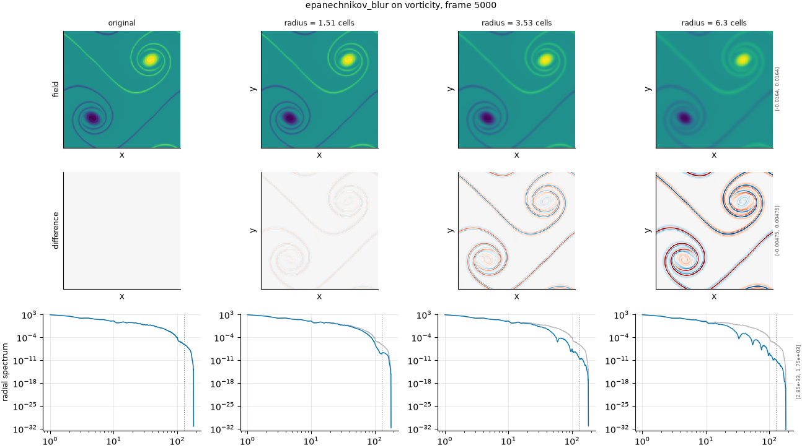

## Definition

Each cell is replaced by a weighted mean over a disk of radius $r$ cells, with the
weights following a parabolic profile, three quarters of one minus the squared normalised distance, inside the radius and zero outside:

$$
g(x) = \sum_{|y| \le r} \frac{K(|y| / r)}{Z} \, f(x - y) \tag{1}
$$

with $Z$ chosen so the weights sum to one, applied to each channel independently. The
radius is rounded up to whole cells when the kernel array is built, so the discrete
kernel is slightly wider than the nominal radius.

It is the kernel that minimises mean squared error for a given bandwidth, so it sits between the box and the Gaussian in sharpness and is the mildest of the windowed kernels at matched radius.

### Boundary handling

Periodic wrap, matching the doubly periodic domain: the kernel takes its
neighbours from the opposite edge rather than padding.

## Intuition

This stands in for the same failure as the other smoothing kernels -- a surrogate
that has lost its small scales -- and exists to vary the *shape* of the kernel rather
than the amount. Two operators that remove a similar quantity of structure by differently
shaped windows are the cleanest way to ask whether a metric is measuring how much
smoothing happened or what kind.

Applied to a picture, the isotropic profile leaves round haloes rather than the square
ones a box kernel produces, and the transition from feature to background is sharper than
a Gaussian's at matched width.

```
before                 after (radius = 1.5 cells)
0 0 0 0                0.03 0.18 0.18 0.03
0 1 1 0                0.18 0.61 0.61 0.18
0 1 1 0                0.18 0.61 0.61 0.18
0 0 0 0                0.03 0.18 0.18 0.03
```

What it leaves untouched is the spatial mean, which is preserved exactly, and the
position of everything: features spread but do not move.

## Severity scale

The severity is the kernel radius in analysis-grid cells, given in the
configuration as a fraction of the field's characteristic scale and resolved per field
against a measured spectrum, so the same configured number becomes a different radius on
density than on vorticity.

The ladder is configured at 0.06, 0.14 and 0.25 of the characteristic scale. This axis is
**disabled in the default ladder**: it overlaps heavily with the Gaussian and box kernels,
and the ladder is kept short so that every axis in a run earns its cost. Enable it when
the question is specifically whether a metric distinguishes kernel shapes.

## Limitations

Disabled by default, so a run will not include it unless asked. It is the kernel that minimises mean squared error for a given bandwidth, so it sits between the box and the Gaussian in sharpness and is the mildest of the windowed kernels at matched radius.

The radius is rounded up to whole cells when the discrete kernel is built, so two
configured severities that differ by less than one cell of radius produce the same
operator. On a field with a small characteristic scale that quantisation is coarse, and a
severity level that collapses onto its neighbour is flagged and excluded rather than
counted.

As with every kernel here, this is a uniform smoothing applied everywhere at once, which
is not how a real surrogate loses its small scales.

## Exemplars

### The panel

<!-- GENERATED exemplars: written by `python -m fmeval.cards exemplars epanechnikov_blur`, do not edit -->



**epanechnikov_blur** on vorticity, frame 5000 of `kinet_re5e4`. Three radii spanning the range from barely visible to clearly resolution-losing. The radial spectrum row is what separates this kernel from the Gaussian at matched width, since the epanechnikov profile has a different roll-off and, unlike a Gaussian, does not attenuate every wavenumber monotonically.

| configured | applied | difference RMS | power retained |
|---|---|---|---|
| 0.06 | 1.511 | 0.0001939 | 0.9929 |
| 0.14 | 3.526 | 0.0006306 | 0.9738 |
| 0.25 | 6.296 | 0.001057 | 0.943 |

<!-- END GENERATED exemplars -->

The field row shows round rather than square haloes, which is the visible
difference from the box kernel. At the weakest radius the change is subtle; use the
difference row, where the effect concentrates at feature edges.

The radial spectrum row is where this kernel earns its place. Compare its curve against
the Gaussian panel at matched severity: the roll-off has a different shape, and the
sign-changing transfer function leaves structure the Gaussian's smooth exponential does
not. If a metric responds identically here and on the Gaussian axis, it is measuring the
amount of smoothing and nothing about its character.

## References

\bibliography
