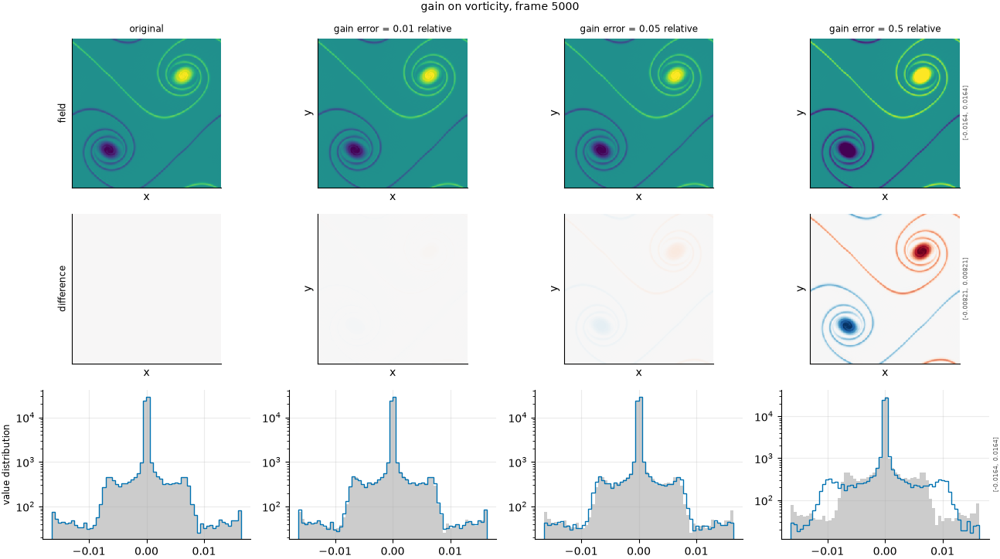

## Definition

The fluctuation about the spatial mean is scaled and the mean restored:

$$
g(x) = \bar{f} + (1 + a)\bigl(f(x) - \bar{f}\bigr) \tag{1}
$$

where $\bar{f}$ is the spatial mean of the field and $a$ the configured gain error.
Equation (1) preserves the spatial mean exactly and scales every fluctuation by the same
factor, so the field's spatial pattern is completely unchanged and only its contrast
moves.

In wavenumber space this multiplies every mode except $k = 0$ by a constant, leaving the
shape of the spectrum untouched and shifting its level.

### Boundary handling

None. The operation is local to each cell once the spatial mean is known, and the mean
is a global reduction rather than a neighbourhood, so no boundary condition enters.

## Intuition

This stands in for a surrogate that gets the pattern right and the amplitude wrong --
predictions that are systematically too energetic or too damped, everywhere at once. It is
a common and benign-looking failure: a model can be reproducing every structure in the
right place and still be reporting them at nine tenths of their true strength.

It is the simplest degradation in the suite and is here as a control. Any metric responds
to it, so a metric that does not is broken; and because it changes nothing spatial, it
separates metrics that measure amplitude from metrics that measure structure.

```
before                 after (gain error 0.5)
0 0 0 0                -0.12 -0.12 -0.12 -0.12
0 1 1 0                -0.12  1.38  1.38 -0.12
0 1 1 0                -0.12  1.38  1.38 -0.12
0 0 0 0                -0.12 -0.12 -0.12 -0.12
```

The mean is still 0.25. The bright cells have gone further above it and the dark cells
further below, including below zero -- which is what a pure contrast change looks like.

What it leaves untouched is position, the spatial mean, and the shape of the spectrum:
every structure is exactly where it was and exactly the shape it was.

## Severity scale

The severity is the relative gain error, so 0.1 means the fluctuation is multiplied by
1.1. It is absolute in the sense of needing no per-field calibration: a ratio is already
comparable between fields.

The ladder is configured at 0.01, 0.05, 0.2 and 0.5. The axis is disabled by default,
because every metric in the current panel responds to it in the same trivially monotone
way and it discriminates between none of them.

## Limitations

Disabled by default; this is a control, not a discriminating test.

Scaling the fluctuation rather than the raw field is a deliberate choice with a
consequence: on the density field, whose mean is 1.0 and whose fluctuations are of order
1e-4, scaling the raw field would be an enormous perturbation dominated entirely by the
background. Equation (1) keeps the experiment about the structure, but it means the
operator is not simply "multiply the field", and a reader expecting the latter will
misread the severity.

As an imitation of a real failure it is very optimistic: real amplitude errors vary in
space and with scale, and a single constant factor is the easiest possible version.

## Exemplars

### The panel

<!-- GENERATED exemplars: written by `python -m fmeval.cards exemplars gain`, do not edit -->



**gain** on vorticity, frame 5000 of `kinet_re5e4`. One percent is far below visibility; a half is a gross amplitude error. The pdf row is the direct view of the mechanism, since a gain change rescales the distribution of values about its centre without moving anything in space.

| configured | applied | difference RMS | power retained |
|---|---|---|---|
| 0.01 | 0.01 | 2.573e-05 | -- |
| 0.05 | 0.05 | 0.0001287 | -- |
| 0.5 | 0.5 | 0.001287 | -- |

<!-- END GENERATED exemplars -->

The field row will look like a contrast adjustment, because that is exactly what it
is. Nothing moves between columns; only the range of values widens.

The pdf row is the direct view: the distribution stretches about its centre while its
centre stays put. Check that the mean is unmoved across all four columns -- if it drifts,
the operator is not doing what this card describes.

There is no spectrum row because there would be nothing to see: the shape of the spectrum
is unchanged and only its level shifts, which a log-log plot renders as a rigid vertical
translation.

## References

\bibliography
