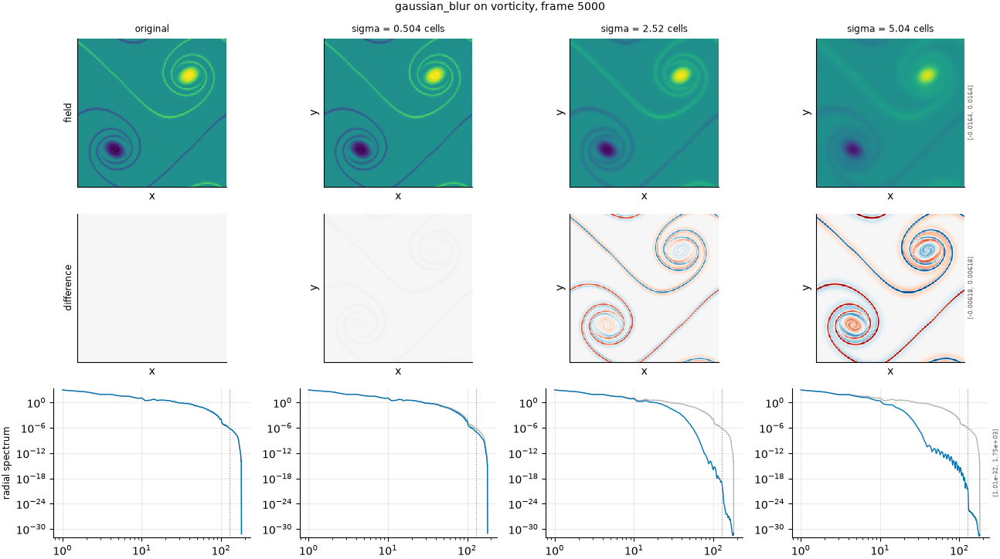

## Definition

The field is convolved with an isotropic Gaussian of standard deviation $\sigma$ cells,

$$
g(x) = \sum_{y} \frac{1}{Z} \exp\!\left(-\frac{|y|^2}{2\sigma^2}\right) f(x - y) \tag{1}
$$

with $Z$ chosen so the weights sum to one, applied independently to each channel and
separably along each spatial direction. Because the weights are positive and normalised,
the spatial mean of the field is preserved exactly.

In wavenumber space Equation (1) multiplies each mode by
$\exp(-\tfrac{1}{2}\sigma^2 k^2)$, which is monotone in $|k|$: every scale is attenuated,
smaller scales more, and none is amplified. That monotonicity is what separates this
kernel from the box and disk kernels, whose transfer functions change sign.

### Boundary handling

Periodic wrap, matching the doubly periodic domain. The convolution takes its
neighbours from the opposite edge rather than padding, so no artificial gradient is
created at the boundary.

## Intuition

This stands in for a surrogate that is too dissipative — one whose fields are smooth where
the truth is sharp. It is the most common way an ML surrogate fails: trained to minimise
an error measured cell by cell, a model does best by predicting something blurry, because
a sharp feature in slightly the wrong place is punished harder than no sharp feature at
all.

Applied weakly, the field looks almost unchanged and only the finest grain softens.
Applied strongly, eddies merge, sharp fronts spread into ramps, and the picture takes on
the appearance of a lower-resolution simulation. The first thing a person notices is that
the extremes are gone: the brightest and darkest spots move toward the middle, because
each cell is replaced by an average of its neighbourhood.

```
before                 after (sigma = 1 cell)
0 0 0 0                0.13 0.23 0.23 0.13
0 1 1 0                0.23 0.42 0.42 0.23
0 1 1 0                0.23 0.42 0.42 0.23
0 0 0 0                0.13 0.23 0.23 0.13
```

The corners are not near zero, and that is the periodic wrap at work: on a four-by-four
grid every cell is within a cell or two of the bright square the other way round the
domain. The mean is exactly preserved.

What this degradation leaves untouched is the total: the mean of the field is exactly
preserved, and nothing is moved anywhere. Only the contrast between neighbours is reduced,
which makes this a clean test of whether a metric is measuring amplitude at small scales.

## Severity scale

The severity is the kernel standard deviation, ultimately in analysis-grid cells,
but it is given in the configuration as a fraction of the field's own characteristic
scale and resolved per field against a spectrum measured from the data.

That indirection is necessary rather than decorative. Measured on this dataset, density
varies on a scale of roughly 136 cells against roughly 29 for vorticity, so a fixed
sigma in cells that bites on vorticity does almost nothing to density: the previously
configured fixed list reached a damage of 0.142 on vorticity and 0.012 on density, an
degradation carrying no signal at all on the smoother field. Because the resolution is
per-field, the same configured severity becomes a different number of cells on each
field, and the sequence of strengths is comparable in effect rather than in cells.

The strengths run at fractions 0.02, 0.05, 0.10 and 0.20 of the characteristic scale.

## Limitations

A Gaussian is a fair imitation of numerical dissipation and a poor imitation of a
model that fails selectively. Real surrogates do not lose all small scales uniformly;
they often lose them in some regions and not others, or lose sharp fronts while keeping
smooth gradients. This operator removes structure everywhere at once, so a metric that
handles it well has not been shown to handle realistic smoothing errors.

Because a Gaussian takes a fractional sigma, its severity levels stay distinct at any
spacing, which makes it the best-behaved degradation in this family — the windowed kernels
quantise to odd cell counts and can collapse. The trade is that its roll-off is gentle,
so a metric sensitive only to a sharp spectral cut-off will see less here than the ideal
low-pass provides.

## What the degradation looks like

### The picture

<!-- GENERATED exemplars: written by `python -m fmeval.cards exemplars gaussian_blur`, do not edit -->



**gaussian_blur** on vorticity, frame 5000 of `kinet_re5e4`. Weak is near the grid limit and barely visible by eye; medium removes the dissipation range; strong reaches into the energetic scales. The radial spectrum is the row that makes the cut-off explicit, since a smooth roll-off in real space looks like very little until the spectrum is drawn.

| configured | applied | difference RMS | power retained |
|---|---|---|---|
| 0.02 | 0.5037 | 9.956e-05 | 0.9963 |
| 0.1 | 2.518 | 0.0009608 | 0.9455 |
| 0.2 | 5.037 | 0.001369 | 0.8767 |

<!-- END GENERATED exemplars -->

The field row shows the picture softening from left to right, but a Gaussian is
deceptive by eye: at the weakest setting almost nothing appears to change. Check the
radial spectrum row instead. There the effect is unmistakable, as the curve peels away
from the grey reference at high wavenumber and the departure point marches to lower
wavenumber as the severity rises. The difference row shows where the change is
concentrated: at the edges of features, not in the smooth interiors, which is the
signature of a derivative-like operator.

If a metric reports little change while the spectrum row shows the small scales gone,
that metric is not measuring what it must.

## References

\bibliography
