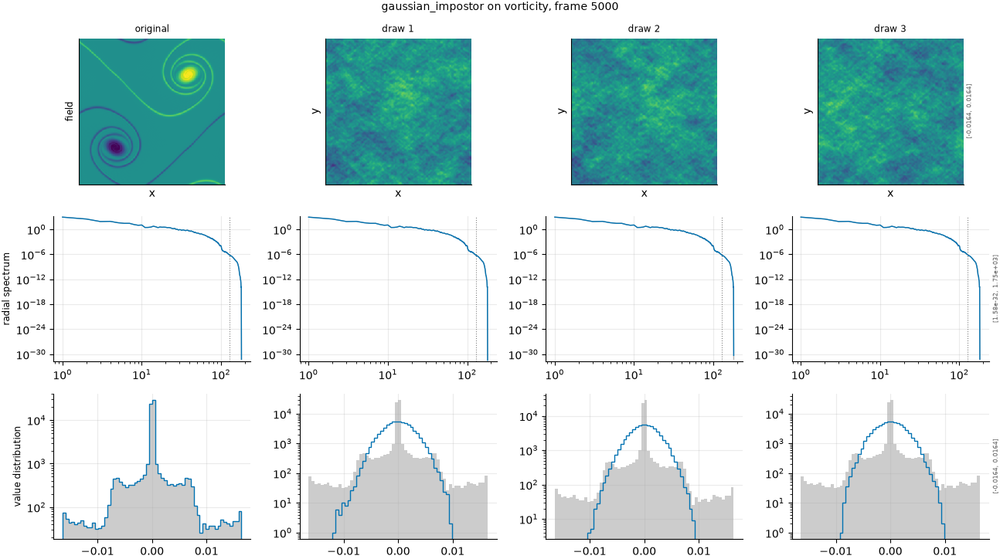

## Definition

The field is transformed, its phases are replaced by uniform random draws while every
mode's magnitude is kept, and it is transformed back:

$$
\hat{g}(k) = |\hat{f}(k)|\, e^{i\theta(k)}, \qquad
\theta(k) \sim \mathcal{U}(0, 2\pi) \tag{1}
$$

with the phases constrained by Hermitian symmetry so the result is real. By construction
the amplitude spectrum of $g$ is **identical** to that of $f$, mode for mode, so every
statistic derived from the power spectrum alone is preserved exactly.

By default the first two moments are matched as well, so the mean and variance agree with
the reference in addition to the spectrum.

This operator is declared ``ordinal=False``: it has no severity and is excluded from every
rank correlation.

### Boundary handling

Periodic by construction, inherited from the discrete Fourier transform.

## Intuition

This is the IN-4 canary, and it is not imitating a model failure. It exists to catch a
specific way a metric can be worthless: responding only to the amplitude spectrum.

A great many attractive metrics are built on spectra -- energy spectra, structure
functions, spectral distances -- and every one of them is at risk of being phase-blind. A
phase-blind metric will report that this field, which shares the reference's spectrum
exactly and has none of its structure, is an excellent prediction. If a metric scores the
impostor well, it must not be used alone, whatever else it does.

In a picture, the result is unmistakable to a human and invisible to a spectrum: the
texture and the grain and the range of values all look right, and there are no coherent
structures at all. Vortices, fronts and filaments are replaced by featureless mottling
with the same statistics.

```
16x16 field           original     impostor
spatial mean          0.0625       0.0625
standard deviation    0.2421       0.2421
```

The mean and the standard deviation match to every digit, and so does every point of the
amplitude spectrum. Only the phases differ, and the phases are where the structure lived.

What it leaves untouched is the entire amplitude spectrum and the low-order moments. What
it destroys is everything spatial.

## Severity scale

There is no severity scale. The configured value 0 is a placeholder, the operator
ignores it, and the ladder entry has one level.

That is why the operator declares itself non-ordinal: with a single unordered experiment
there is nothing to rank, and including it in a rank correlation would be meaningless. It
is reported as a probe -- one damage number per metric and field -- rather than as an
axis.

## Limitations

The canary catches a narrower class of metric than it first appears to, and the
measurement here is worth stating plainly: it does **not** catch the L^p family. MSE
assigns the impostor 0.80 damage on vorticity and 0.51 on velocity, which is firm
rejection, because a pointwise norm is phase-sensitive by nature.

So a report in which every implemented metric rejects the impostor is not evidence that
the panel is well guarded; it is evidence that no spectrum-only metric has been
implemented yet. The canary earns its place when one is.

Matching the first two moments is a default rather than a necessity, and it makes the
impostor harder to detect than the phase randomisation alone would. Turning it off makes
the test weaker, not stronger.

Only the first two moments are matched, and the panel shows what that leaves open. On the
canonical vorticity frame the reference has a flatness of 17.1, the signature of an
intermittent field whose extreme values are far more common than a Gaussian would predict;
the three impostor draws have flatnesses of 3.05, 3.04 and 2.85, which is the Gaussian
value of 3. So a metric built on a fourth moment separates them immediately, while the
spectrum and the variance cannot. That is a limit on what this canary tests rather than a
defect: it catches metrics that see only the amplitude spectrum, and a flatness statistic
is not one of them.

## Exemplars

### The panel

<!-- GENERATED exemplars: written by `python -m fmeval.cards exemplars gaussian_impostor`, do not edit -->



**gaussian_impostor** on vorticity, frame 5000 of `kinet_re5e4`. Three independent draws beside the original, because there is no severity to vary. The radial spectrum row is the whole argument: every draw lies exactly on the reference curve, so any metric built on that curve cannot distinguish them from the truth. The pdf row shows the moments matching too.

3 independent draws, seeded from the run seed so they reproduce exactly.

<!-- END GENERATED exemplars -->

Do not look at the field row expecting a difficulty: the impostor is obvious to any
human eye, and that is precisely the argument. A field that a person identifies as wrong
in under a second is being described by these panels as statistically identical.

The radial spectrum row is the one that carries the point. All four curves -- the original
and three draws -- should lie exactly on top of one another. Any metric that could be
computed from that panel alone cannot tell these fields apart.

The pdf row makes the same point for the distribution of values. Between them, the two
diagnostic rows say: everything a spectrum or a histogram can see is preserved, and the
field is still completely wrong.

## References

\bibliography
