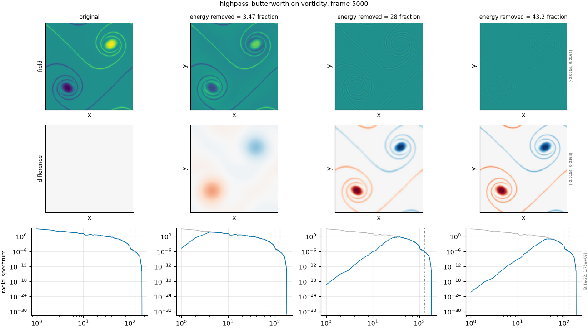

## Definition

The field is transformed, multiplied by a transfer function, and transformed back:

$$
\hat{g}(k) = H(|k|)\, \hat{f}(k), \qquad H(|k|) = \left[1 + (k_c / |k|)^{2n}\right]^{-1/2} \tag{1}
$$

with order $n$, configured at 4 by default, and the $k = 0$ mode kept so that the
spatial mean survives. The roll-off is gradual rather than abrupt, which lets this variant
resolve severity levels the ideal filter cannot on a field whose energy sits in a few low
modes.

The wavenumber magnitude $|k|$ is the single definition shared with the severity
calibration, in ``fmeval.wavenumbers``. That sharing is not incidental: the filters and
the calibration once used two different definitions -- a continuous magnitude against
binned shells -- which put the diagonal modes on opposite sides of the same cutoff, and a
low-pass asked to remove 30% of the energy on density removed 99.997% of it, with every
intermediate number looking plausible.

### Boundary handling

Periodic by construction. The discrete Fourier transform assumes a periodic domain,
which this one is, so the filter wraps exactly and no windowing or padding is applied. On
a non-periodic field the transform would impose a spurious discontinuity at the edge and
the filter would ring against it.

## Intuition

This stands in for the same failure as the ideal high-pass -- large-scale structure
lost while fine detail survives -- with a gradual transition instead of a hard one.

Its purpose in the default set is the same as the Butterworth low-pass: resolving levels.
The high-pass degradation is the most badly squeezed in the suite, with only a handful of
modes between doing nothing and destroying everything, and a smooth transfer function is
what allows four requested fractions to produce four distinguishable fields rather than
two.

In a picture, the broad structure fades rather than vanishing, so a ghost of the
large-scale organisation remains beneath the texture.

```
before (16x16, a bright 4x4 block)     after (low-pass removing 30% of energy)
max value       1.000                  max value       0.062
spatial mean    0.0625                 spatial mean    0.0625
```

The mean is untouched and the peak is almost gone: the block was built almost entirely
from the small scales the filter removed.

What this degradation leaves untouched is the spatial mean, which is preserved
deliberately: the k = 0 mode is kept even though it lies below the cutoff.

## Severity scale

The severity is the fraction of fluctuation energy removed from below the cutoff, and the
configured strengths ask for 45%, 70%, 90% and 97%, matching the ideal variant. The order
is a fixed option at 4 rather than part of the severity.

## Limitations

The smooth roll-off removes some energy from every scale rather than only from below the
cutoff, so this degradation is less cleanly separated from the low-pass degradations than
its ideal counterpart is.

It shares the fundamental squeeze of the high-pass direction: on a field whose energy is
concentrated in a few low modes there is only so much room between doing nothing at all
and near-total removal, and a smoother filter widens that room without creating it.

## What the degradation looks like

### The picture

<!-- GENERATED exemplars: written by `python -m fmeval.cards exemplars highpass_butterworth`, do not edit -->



**highpass_butterworth** on vorticity, frame 5000 of `kinet_re5e4`. Three fractions spanning the usable range of this axis. The radial spectrum row is the one that shows the mechanism directly -- the cutoff is visible as the wavenumber where the curve departs from the reference -- and the difference row shows which structures in real space carried the removed energy.

| configured | applied | difference RMS | power retained |
|---|---|---|---|
| 0.45 | 3.471 | 0.001636 | 0.1541 |
| 0.9 | 28.01 | 0.0024 | 0.006098 |
| 0.97 | 43.15 | 0.002505 | 0.001279 |

<!-- END GENERATED exemplars -->

Compare against the ideal high-pass panel. The field row here retains a faint ghost of
the large-scale structure where the ideal filter removed it completely, and that ghost is
the smooth roll-off made visible.

In the radial spectrum row the suppression at low wavenumber is gradual, with no edge to
read a cutoff from. Check the weak column carefully: this is the variant that is supposed
to produce a distinguishable weak level where the ideal filter barely changes the field at
all.

## References

\bibliography
