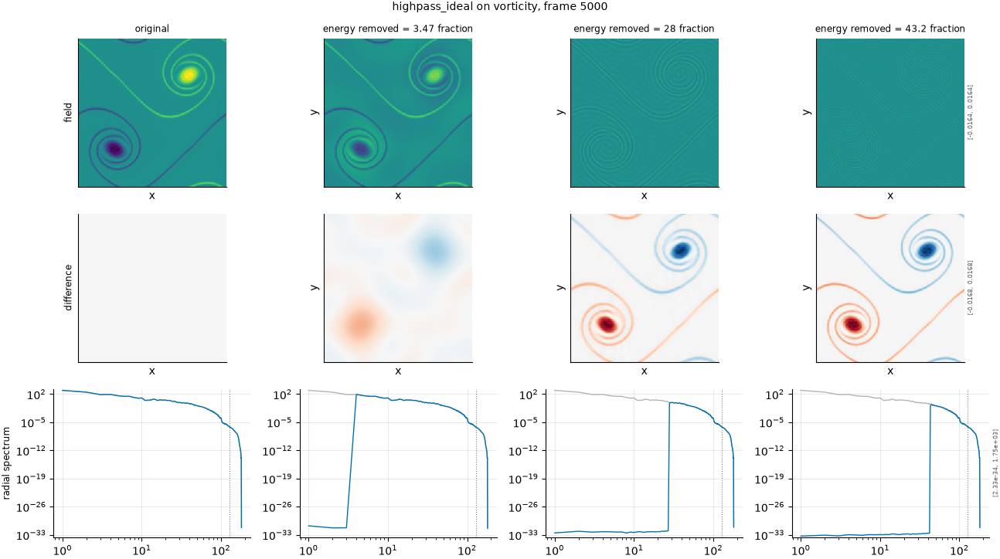

## Definition

The field is transformed, multiplied by a transfer function, and transformed back:

$$
\hat{g}(k) = H(|k|)\, \hat{f}(k), \qquad H(|k|) = 0 \text{ for } 0 < |k| < k_c, \quad 1 \text{ otherwise} \tag{1}
$$

Note the strict inequality on the left: the $k = 0$ mode is **kept** regardless of the
cutoff, so the spatial mean survives the filter.

That exception is essential rather than cosmetic. Deleting $k = 0$ on the density field
would remove a component four orders of magnitude larger than anything the cutoff
controls: every severity then produced an identical damage of 2.7e7 and the degradation
carried no ordering at all.

The wavenumber magnitude $|k|$ is the single definition shared with the severity
calibration, in ``fmeval.wavenumbers``. That sharing is not incidental: the filters and
the calibration once used two different definitions -- a continuous magnitude against
binned shells -- which put the diagonal modes on opposite sides of the same cutoff, and a
low-pass asked to remove 30% of the energy on density removed 99.997% of it, with every
intermediate number looking plausible.

### Boundary handling

Periodic by construction. The discrete Fourier transform assumes a periodic domain,
which this one is, so the filter wraps exactly and no windowing or padding is applied. On
a non-periodic field the transform would impose a spurious discontinuity at the edge and
the filter would ring against it.

## Intuition

This stands in for the opposite failure to over-smoothing: a surrogate that has the
fine detail right and the large-scale organisation wrong. It is the rarer failure, but it
is the one a metric dominated by the energetic scales will miss entirely, since almost all
of a turbulent field's energy lives in the large structures this operator removes.

In a picture the result is striking: the broad shapes vanish and what remains is texture --
edges, filaments and grain, floating on a flat background at the original mean level.

```
before (16x16, a bright 4x4 block)     after (low-pass removing 30% of energy)
max value       1.000                  max value       0.062
spatial mean    0.0625                 spatial mean    0.0625
```

The mean is untouched and the peak is almost gone: the block was built almost entirely
from the small scales the filter removed.

What this degradation leaves untouched is the spatial mean, which is preserved
deliberately: the k = 0 mode is kept even though it lies below the cutoff.

## Severity scale

The severity is the fraction of spectral energy removed, which here means the energy
**below** the cutoff, and the numbers are large because that is where the energy is: the
configured strengths ask for 45%, 70%, 90% and 97%.

Those look extreme beside the low-pass list and are not. Removing 45% of a turbulent
field's energy from the bottom of the spectrum takes only the first few modes, because the
spectrum is so steep.

## Limitations

This degradation is squeezed between doing nothing at all and near-total destruction, and
on density it is badly squeezed. With 69% of the fluctuation energy in the four diagonal
modes at $|k| = \sqrt{2}$, a cutoff below them removes essentially nothing and a cutoff
above them removes essentially everything; there is very little room in between. The
degradation therefore does not reach the factor-five damage range the other degradations
achieve, and that is a property of these fields rather than of the configuration.

Keeping $k = 0$ is the right choice but it makes the "fraction of energy removed" slightly
inconsistent with the name: the fraction is computed over the fluctuation, excluding the
mean, so a request for 97% does not mean 97% of the total field energy.

## What the degradation looks like

### The picture

<!-- GENERATED exemplars: written by `python -m fmeval.cards exemplars highpass_ideal`, do not edit -->



**highpass_ideal** on vorticity, frame 5000 of `kinet_re5e4`. Three fractions spanning the usable range of this axis. The radial spectrum row is the one that shows the mechanism directly -- the cutoff is visible as the wavenumber where the curve departs from the reference -- and the difference row shows which structures in real space carried the removed energy.

| configured | applied | difference RMS | power retained |
|---|---|---|---|
| 0.45 | 3.471 | 0.001667 | 0.1808 |
| 0.9 | 28.01 | 0.002441 | 0.007669 |
| 0.97 | 43.15 | 0.002534 | 0.001704 |

<!-- END GENERATED exemplars -->

The field row looks unlike anything else in the gallery: a flat background with only
texture on it. Check that the background level matches the original's mean rather than
zero -- that is the preserved $k = 0$ mode, and it is the difference between this
degradation being informative and being a constant.

The radial spectrum row shows the mirror image of the low-pass panels, with the curve
suppressed at low wavenumber and following the reference above the cutoff. Watch how few
modes lie between the weak and strong columns: that narrowness is why this degradation
carries less dynamic range than the others.

## References

\bibliography
