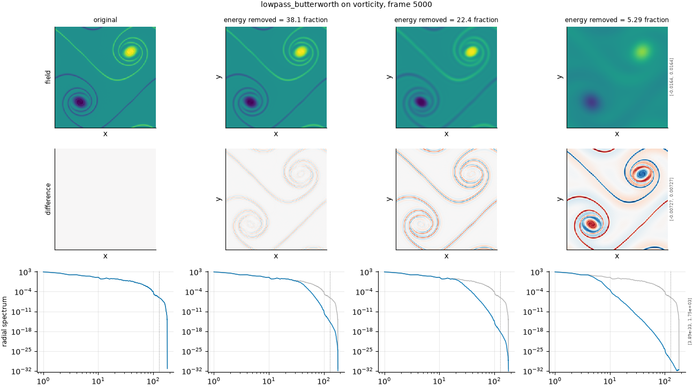

## Definition

The field is transformed, multiplied by a transfer function, and transformed back:

$$
\hat{g}(k) = H(|k|)\, \hat{f}(k), \qquad H(|k|) = \left[1 + (|k| / k_c)^{2n}\right]^{-1/2} \tag{1}
$$

with order $n$, configured at 4 by default. The roll-off is smooth rather than
abrupt: the transfer function falls monotonically through the cutoff instead of stepping,
and higher orders approach the ideal filter.

As with the ideal variant, the cutoff is resolved from a requested energy fraction against
a measured spectrum rather than configured directly.

The wavenumber magnitude $|k|$ is the single definition shared with the severity
calibration, in ``fmeval.wavenumbers``. That sharing is not incidental: the filters and
the calibration once used two different definitions -- a continuous magnitude against
binned shells -- which put the diagonal modes on opposite sides of the same cutoff, and a
low-pass asked to remove 30% of the energy on density removed 99.997% of it, with every
intermediate number looking plausible.

### Boundary handling

Periodic by construction. The discrete Fourier transform assumes a periodic domain,
which this one is, so the filter wraps exactly and no windowing or padding is applied. On
a non-periodic field the transform would impose a spurious discontinuity at the edge and
the filter would ring against it.

## Intuition

This stands in for the same failure as the ideal low-pass -- a surrogate that has lost
its fine structure -- with a gradual roll-off instead of a cliff. It sits between the
Gaussian kernel and the ideal filter: smoother than the cut, sharper than the blur.

Its real purpose in the default set is practical. A sharp filter cannot resolve four
distinct severity levels on a field whose energy is concentrated in a handful of low
modes, because the available cutoffs are too far apart. A smooth roll-off can: the
transfer function is continuous in the cutoff, so a small change in the requested energy
fraction produces a small change in the field even when no new mode has crossed the
boundary.

In a picture, the ringing that the ideal filter produces is largely absent, and the result
looks closer to a blur than to a cut.

```
before (16x16, a bright 4x4 block)     after (low-pass removing 30% of energy)
max value       1.000                  max value       0.062
spatial mean    0.0625                 spatial mean    0.0625
```

The mean is untouched and the peak is almost gone: the block was built almost entirely
from the small scales the filter removed.

What this degradation leaves untouched is the spatial mean: the
k = 0 mode is far below any cutoff this degradation uses.

## Severity scale

The severity is the fraction of spectral energy removed, resolved per field to a cutoff
wavenumber exactly as for the ideal filter, and the configured strengths ask for the same
5%, 15%, 30% and 45%. The filter order is a separate option, fixed at 4, and is not part
of the severity: changing it changes the character of the degradation rather than its
strength.

## Limitations

The smooth roll-off that makes the levels resolvable also makes the cutoff less
meaningful. Energy is removed from both sides of $k_c$, so the wavenumber reported for a
given severity is a nominal centre rather than a boundary, and a metric that estimates a
cut-off wavenumber from the filtered field will not recover it exactly.

Being smoother, it is also more similar to the Gaussian kernel than the ideal filter is,
so it discriminates less sharply between metrics. The two variants are both in the default
set because each is better than the other at a different job: the ideal one discriminates,
the Butterworth one resolves levels.

## What the degradation looks like

### The picture

<!-- GENERATED exemplars: written by `python -m fmeval.cards exemplars lowpass_butterworth`, do not edit -->



**lowpass_butterworth** on vorticity, frame 5000 of `kinet_re5e4`. Three fractions spanning the usable range of this axis. The radial spectrum row is the one that shows the mechanism directly -- the cutoff is visible as the wavenumber where the curve departs from the reference -- and the difference row shows which structures in real space carried the removed energy.

| configured | applied | difference RMS | power retained |
|---|---|---|---|
| 0.05 | 38.05 | 0.0004872 | 0.9947 |
| 0.15 | 22.43 | 0.0009086 | 0.9813 |
| 0.45 | 5.29 | 0.001687 | 0.8725 |

<!-- END GENERATED exemplars -->

Compare the radial spectrum row against the ideal low-pass panel at matched severity.
Here the curve bends away from the reference over a range of wavenumbers instead of
dropping off a cliff, and there is no sharp edge to read a cutoff from.

The field row shows softening without the ringing the ideal filter leaves, so it looks
much like a blur. That resemblance is worth checking against the Gaussian panel: if a
metric cannot separate this degradation from the smoothing degradations, that metric is
responding only to lost energy.

## References

\bibliography
