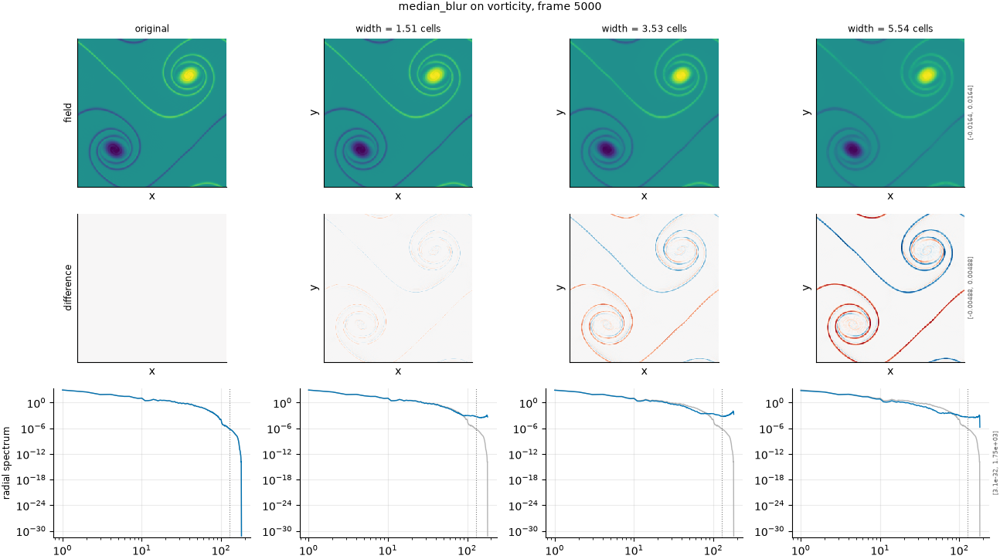

## Definition

Each cell is replaced by the median of a square neighbourhood of odd width $w$,

$$
g(x) = \operatorname{median}\{\, f(x - y) : |y_i| \le (w-1)/2 \,\} \tag{1}
$$

applied to each channel independently. Equation (1) is **nonlinear**: it has no transfer
function, it does not commute with addition, and unlike every other operator in this
family it does **not** preserve the spatial mean. A feature smaller than half the window
is removed outright rather than spread.

### Boundary handling

Periodic wrap. The window takes its neighbours from the opposite edge, so the median
near an edge is computed over the same number of cells as anywhere else.

## Intuition

This stands in for a surrogate that suppresses isolated small-scale structure while
keeping large discontinuities sharp -- a model that has learned to reproduce the strong
fronts in its training data and quietly drops the shocklets and thin filaments between
them.

That behaviour is exactly what a median does, and it is why this operator is in the
ladder despite being the least like a numerical error. A linear blur softens everything
in proportion. A median leaves a large region entirely alone and deletes a small one
completely, which is a different failure and one a metric can be blind to.

On the four-by-four example, with a window of three cells, the entire feature disappears:

```
before                 after (width = 3 cells)
0 0 0 0                0 0 0 0
0 1 1 0                0 0 0 0
0 1 1 0                0 0 0 0
0 0 0 0                0 0 0 0
```

The bright square occupies four of sixteen cells, so in every three-by-three window the
zeros outnumber the ones and the median is zero everywhere. The mean falls from 0.25 to
0, which no linear kernel in this family would do.

What it leaves untouched is any feature wider than about half the window: a large front
comes through with its edge intact and unsmoothed, which is the property that makes this
a genuinely different test from the other kernels.

## Severity scale

The severity is the window width in analysis-grid cells, given as a fraction of the
field's characteristic scale and resolved per field, then rounded to an odd number for the
same reason as the box kernel: an even window has no centre cell and displaces the field
by half a cell.

The ladder runs at 0.06, 0.14 and 0.22 -- three levels rather than the four the other
smoothing axes carry, because the median's damage rises steeply and the fourth level
offered no additional separation on either field.

## Limitations

The mean is not preserved, which makes this operator unlike everything else in its
family and worth watching. A metric that is sensitive to the spatial mean will register a
large change here that has nothing to do with the small-scale structure the operator is
meant to be testing, and reading that as sensitivity to smoothing would be wrong.

The nonlinearity also means the severity has no spectral interpretation: there is no
cut-off wavenumber and no fraction of energy removed, so the calibration can only scale
the width and cannot equalise the effect between fields the way it can for a filter. The
damage at a given fraction is therefore less comparable across fields here than on the
other axes.

On a small analysis grid the window can approach the field size, at which point the
operator returns a constant and the level is a no-op rather than a severity.

## Exemplars

### The panel

<!-- GENERATED exemplars: written by `python -m fmeval.cards exemplars median_blur`, do not edit -->



**median_blur** on vorticity, frame 5000 of `kinet_re5e4`. Three widths spanning the range in which the median stops preserving features and starts erasing them. The difference row is the important one: unlike the linear kernels, the median changes some regions and leaves others untouched entirely, which no spectrum can show.

| configured | applied | difference RMS | power retained |
|---|---|---|---|
| 0.06 | 1.511 | 0.0001413 | 0.9843 |
| 0.14 | 3.526 | 0.0004217 | 0.9166 |
| 0.22 | 5.541 | 0.0007884 | 0.801 |

<!-- END GENERATED exemplars -->

Look at the difference row first, not the field row. For the linear kernels the
difference is concentrated at feature edges and falls off smoothly; here it is patchy,
zero across whole regions and abrupt at the boundaries of small features. That patchiness
is the signature of a nonlinear filter and is the thing to check a metric against.

In the radial spectrum row, note that the curve does not have a clean roll-off. A median
has no transfer function, so what appears there is the spectrum of a differently-shaped
field rather than the reference spectrum multiplied by anything. Reading a cut-off
wavenumber off this panel would be a mistake.

## References

\bibliography
