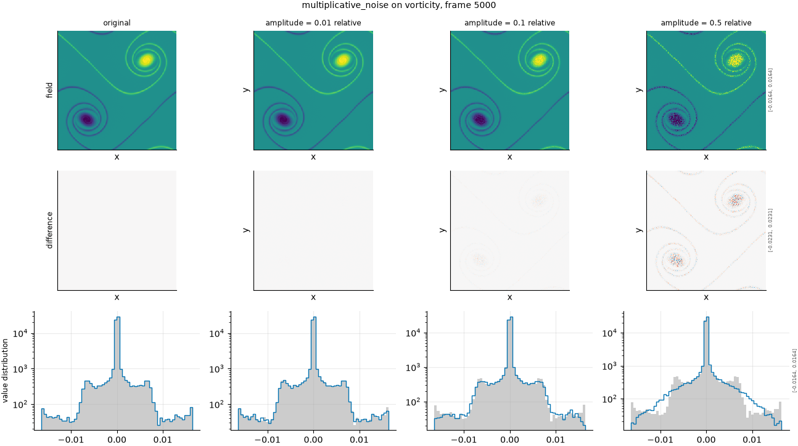

## Definition

Every cell is scaled by an independent random factor:

$$
g(x) = f(x)\,\bigl(1 + a\,\eta(x)\bigr), \qquad \eta \sim \mathcal{N}(0, 1) \tag{1}
$$

with $a$ the configured amplitude. Unlike additive noise, the perturbation in Equation (1)
is proportional to the local field value, so it vanishes wherever the field vanishes and is
largest at the extremes.

Seeding is per run seed, variant label, frame index and field name, as for every stochastic
operator here.

### Boundary handling

None. Each cell is scaled independently and no neighbourhood is consulted.

## Intuition

This stands in for a surrogate whose *relative* error is roughly constant: accurate
where the field is small, proportionally wrong where it is large. That is the error
structure a model trained against a relative or normalised loss tends to produce, and it
is quite different from the constant-magnitude error additive noise imitates.

The distinction matters for metric selection because the two are separable only by a
metric that looks at where the error sits relative to the field's own structure. A
cell-by-cell metric sees a bag of differences either way.

```
before                 after (amplitude 0.5)
0 0 0 0                0     0     0     0
0 1 1 0                0     1.18  1.65  0
0 1 1 0                0     0.37  0.69  0
0 0 0 0                0     0     0     0
```

The zeros stay exactly zero and only the bright cells are perturbed. Compare this against
the additive noise example, where every cell moved: that difference is the entire point of
having both operators.

What this degradation leaves untouched is the location of every zero and, more generally,
the support of the field: nothing appears where nothing was.

## Severity scale

The severity is the standard deviation of the multiplicative factor, and it is
relative by construction -- 0.1 means each cell is multiplied by roughly one plus or minus
a tenth. No per-field calibration is needed, because a ratio is already dimensionless and
already comparable between fields.

This operator is not in the default set of degradations. It overlaps with additive noise
on the degradations that matter most for the current metric set, and the set of
degradations is kept short so that every degradation in a run earns its cost.

## Limitations

The proportionality that makes this realistic for one class of model makes it
unrepresentative for others. A field with large regions near zero is barely perturbed
there, so the degradation concentrates in the energetic regions and leaves the rest
untouched -- which flatters any metric that weights by magnitude.

On a field with a large spatial mean, such as density at 1.0, the perturbation is
dominated by that mean rather than by the fluctuation, so the operator effectively adds
noise proportional to the background rather than to the structure of interest. That is a
different experiment from the one the name suggests, and it is why the amplitude here is
not calibrated against the fluctuation the way additive noise is.

Being stochastic, single draws carry sampling variation.

## What the degradation looks like

### The picture

<!-- GENERATED exemplars: written by `python -m fmeval.cards exemplars multiplicative_noise`, do not edit -->



**multiplicative_noise** on vorticity, frame 5000 of `kinet_re5e4`. Three amplitudes spanning invisible to obvious. The difference row is the one that separates this from additive noise: the error is proportional to the local value, so it is large where the field is large and exactly zero where the field is zero.

| configured | applied | difference RMS | power retained |
|---|---|---|---|
| 0.01 | 0.01 | 2.536e-05 | -- |
| 0.1 | 0.1 | 0.000258 | -- |
| 0.5 | 0.5 | 0.001278 | -- |

<!-- END GENERATED exemplars -->

The difference row is where to look first, and it should be read against the additive
noise panel side by side. Here the difference traces the field itself -- bright where the
field is bright, zero where the field is zero -- while there it is uniform static. Two
degradations of the same nominal strength with entirely different spatial structure is
exactly the discrimination a good metric should register.

The pdf row shows the distribution broadening asymmetrically, stretching the tails rather
than spreading the whole distribution, because the largest values are perturbed most.

## References

\bibliography
