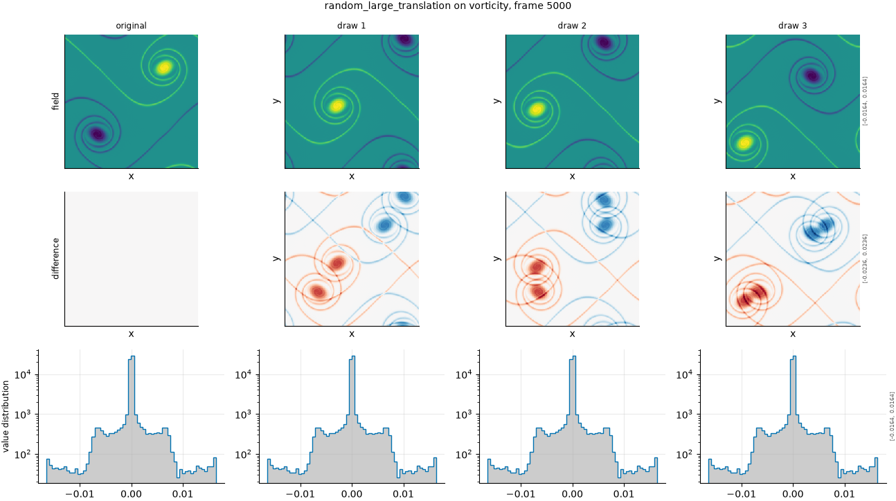

## Definition

The field is rolled by a random offset drawn per axis, uniformly from the middle half
of the domain:

$$
n_i \sim \mathcal{U}\{N/4,\; 3N/4\}, \qquad g(x) = f(x - n) \tag{1}
$$

The offsets are drawn from a generator seeded by the run seed together with the variant
label, the frame index and the field name, so a given draw is reproducible and independent
of the order in which anything is evaluated.

Restricting the offset to the middle half is what makes this an anchor rather than a
severity: a small offset would leave the field partly correlated with its reference, and
an offset near the full domain would wrap back to near-alignment.

This operator is declared ``ordinal=False``. Its levels are draws, not severities, so it
is excluded from every rank correlation.

### Boundary handling

Periodic wrap, exactly as for the whole-cell translation: the operation is a
bijection on the grid and no value is created or destroyed.

## Intuition

This one is not imitating a model failure. It exists to answer a question the other
axes cannot: what number does a metric give for a field that is as wrong as a field can
be while still being the right kind of field?

That question needs an answer because raw metric values mean nothing on their own. The
suite reports damage, a rescaling in which zero is the reference and one is what this
anchor scores, and every statement about how much a degradation costs is made in those
units. If the anchor is wrong, every damage number in the suite is wrong with it.

Using a large translation rather than, say, noise or a distant frame is deliberate. The
result has *exactly* the reference's distribution of values, its variance, its spectrum
and its texture -- it is the same flow, simply not lined up. A metric that scores it well
is telling you it cannot see position at all.

On the four-by-four test field, one draw gives

```
before                 after (one draw)
0 0 0 0                0 0 1 1
0 1 1 0                0 0 1 1
0 1 1 0                0 0 0 0
0 0 0 0                0 0 0 0
```

The feature is intact, the same size and the same brightness, and it is somewhere else.
The multiset of values is identical to the original's, so the mean, the variance and the
histogram all match exactly.

What it leaves untouched is every statistic that does not depend on position. That is the
whole design.

## Severity scale

There is no severity here. The configured numbers 0 through 5 are draw indices, and
the ladder entry named ``uncorrelated`` runs six of them.

Six draws rather than one because a single random offset is a single sample: on a flow
with any large-scale structure, one particular offset can happen to land in partial
alignment and give an anomalously low value. Averaging over draws gives an anchor that is
a property of the field rather than of a lucky shift.

Because the levels are not ordered, this axis is excluded from rank correlation and from
monotonicity checks. It contributes the denominator of the damage scale and nothing else.

## Limitations

Two limits of this anchor were measured rather than assumed, and both are recorded
because the obvious cheaper alternatives are wrong.

A modest translation is not a substitute: a 16-cell shift reaches only about 0.6 of the
true anchor value, and using it would have inflated every damage score in the suite by
roughly 1.6 times. A distant frame is not a substitute either: the flow decays, so a
frame far along the trajectory has about 0.70 of the reference's variance and a different
flatness, making it a different field rather than the same field moved.

The anchor is also specific to a periodic domain. On a non-periodic problem a large
translation would move real structure off the edge, and a different anchor would be
needed.

## Exemplars

### The panel

<!-- GENERATED exemplars: written by `python -m fmeval.cards exemplars random_large_translation`, do not edit -->



**random_large_translation** on vorticity, frame 5000 of `kinet_re5e4`. Three independent draws beside the original, because there is no weak-to-strong ordering to show. The pdf row is the point: every draw has exactly the reference's distribution of values, which is what makes it a fair anchor rather than merely a bad field.

3 independent draws, seeded from the run seed so they reproduce exactly.

<!-- END GENERATED exemplars -->

There is no weak-to-strong progression to look for. Compare the three draws against
one another instead: they should look equally unrelated to the original and equally like
plausible fields in their own right.

The pdf row is the one that carries the argument. All four panels -- original and three
draws -- should show the same distribution of values, because a translation cannot change
which values are present. If they differ, the anchor is not doing its job.

In the difference row, expect large error everywhere rather than error concentrated at
edges. That contrast against the small-shift panels is what the damage scale is built
on.

## References

\bibliography
