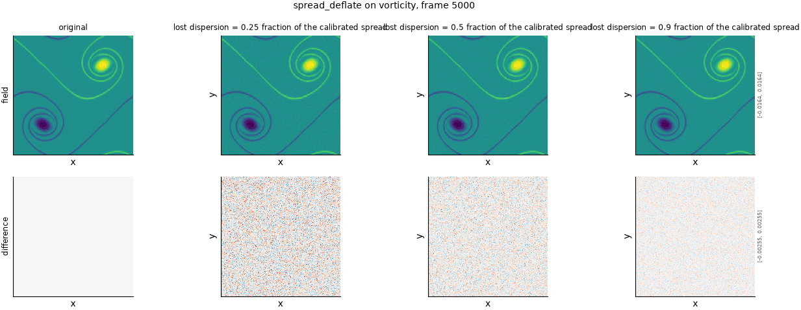

## Definition

For an ensemble $x_1 \dots x_M$ with member-wise mean $\bar{x}$, each member's departure
from the mean is scaled down by $1 - s$:

$$
x_m' = \bar{x} + (1 - s)\,(x_m - \bar{x}) \tag{1}
$$

Severity $s$ is the fraction of dispersion **removed**, so $s = 0$ is a no-op, $s = 0.75$
leaves a quarter of the spread, and $s = 1$ collapses every member onto the mean. Severities
outside $[0, 1]$ are refused rather than clipped: above one the deviations change sign and
the ensemble is reflected through its mean, which is not a stronger version of this failure
but a different and meaningless one.

As with `spread_inflate`, summing Equation (1) over $m$ leaves the mean identically
unchanged, so this operator alters the ensemble's width and nothing else. The sample
standard deviation at every cell is multiplied by exactly $1 - s$.

The two directions are separate operators rather than one signed severity because the ladder
sorts each operator's severities into one order of increasing damage, and dispersion error is
least damaging in the middle. A single signed axis would place its mildest case in the
interior of the severity list and invert the rank correlation across half of it.

### Boundary handling

None. Equation (1) acts cell by cell across the ensemble; no spatial stencil, transform or
neighbourhood is involved, so the domain edge is never consulted.

## Intuition

This makes a prediction overconfident. The members are pulled toward their shared consensus,
so they agree with each other more and more, while the consensus itself does not move. The
forecast keeps saying the same thing but claims to be increasingly sure of it, and nothing
about its central prediction has actually improved.

This is the dangerous half of the calibration axis. An ensemble that overstates its
uncertainty merely wastes information; one that understates it tells a user the answer is
reliable when it is not, and stated uncertainty is precisely what a user consults before
acting. A generative surrogate that has learned to produce confident, nearly identical
samples is a realistic and common way for a model to fail, and it is invisible to every
metric built on the ensemble mean.

The limit is worth thinking about directly. At full severity every member is the mean, so the
prediction has become deterministic while still being presented as an ensemble. Every metric
that reads only the consensus reports exactly what it reported before; only a calibration
metric registers that anything happened at all.

Three members at one cell, deflated by severity 0.75:

```
before (three members)     after (severity 0.75)
2, 4, 6                    3.5, 4, 4.5
```

The mean is 4 before and after. The spread is quartered: each member's distance from the
mean falls from 2, 0, 2 to 0.5, 0, 0.5. The members now nearly agree, and the forecast
presents that agreement as confidence.

What this leaves untouched is the ensemble mean, and therefore every quantity computed from
it — the consensus prediction, its error, and its spectrum.

## Severity scale

Severity is the fraction of the calibrated spread removed, dimensionless and bounded in
$[0, 1]$. Zero is a no-op, 0.5 halves the spread, 1 removes it entirely. Nothing is
calibrated against a measured field property: a dispersion multiplier is already relative to
the ensemble it acts on, so it means the same thing on density and on vorticity.

Damage rises with severity, so the declared direction is `increasing` and the mildest severity
level is zero. Unlike the inflation axis this one has a genuine endpoint, and severities near
1 are the most informative rather than the least — an ensemble at 0.9 is badly overconfident
while still being a real ensemble, which is close to the failure a real model exhibits.

## Limitations

The operator models a uniform, spatially constant loss of dispersion. A real overconfident
surrogate is usually overconfident unevenly — collapsed across the shocks it has learned to
smooth over and adequately spread in the quiet regions — and this axis cannot produce that.
Passing here shows a metric detects uniform overconfidence, nothing narrower.

It preserves the shape of the member distribution: scaling deviations leaves every normalised
moment unchanged, so a failure of the *form* of the uncertainty rather than its width is not
on this axis at all.

At full severity the ensemble is exactly degenerate, and two of the metrics here are defined
rather than measured at that point: the spread-to-skill ratio returns zero and the rank
histogram becomes all ties, resolved by its documented random tie-breaking. Those are honest
values, but they are the definition speaking rather than a measurement, so a run whose
harshest severity level is $s = 1$ is testing the edge case rather than the axis. The ladder in
`configs/degradation/ensemble_miscalibration.yaml` stops at 0.8 for that reason.

Finally, because the mean is preserved exactly, the energy bookkeeping recorded beside every
severity level reads zero removed and zero changed on the ensemble mean. That is correct, but it
means the usual energy-based description of what a severity level did carries no information here.

## What the degradation looks like

### The picture

<!-- GENERATED exemplars: written by `python -m fmeval.cards exemplars spread_deflate`, do not edit -->



**spread_deflate** on vorticity, frame 5000 of `kinet_re5e4`. One member of a synthetic eight-member ensemble built around the canonical field, before and after deflation. The ensemble mean is unchanged by construction, so what shrinks across the columns is how far a single member departs from the consensus. By the last column the member has nearly become the consensus, which is what an overconfident ensemble looks like: every member telling the same story.

| strength requested in the config | strength actually applied to this field | RMS size of the change | fraction of the field's power kept |
|---|---|---|---|
| 0.25 | 0.25 | 0.0006037 | -- |
| 0.5 | 0.5 | 0.0004502 | -- |
| 0.9 | 0.9 | 0.0002809 | -- |

<!-- END GENERATED exemplars -->

The panel shows one member of a synthetic ensemble built around the canonical field, at
three severities. Across the columns the member converges toward the consensus, so the
difference row fades toward flat — the visual signature of an ensemble whose members have
stopped disagreeing. The field row barely changes, which is the point: nothing about the
prediction's content is degrading, only its honesty about how sure it is.

## References

\bibliography
