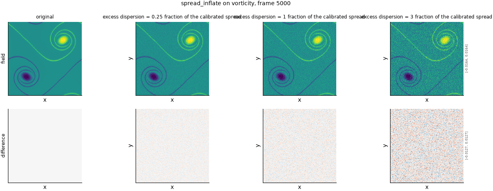

## Definition

For an ensemble $x_1 \dots x_M$ with member-wise mean $\bar{x}$, each member's departure
from the mean is scaled by $1 + s$:

$$
x_m' = \bar{x} + (1 + s)\,(x_m - \bar{x}) \tag{1}
$$

Severity $s$ is the **excess** dispersion, so $s = 0$ is exactly a no-op and $s = 1$ doubles
the spread. Summing Equation (1) over $m$ shows the mean is preserved identically,

$$
\bar{x}' = \bar{x} + (1 + s)\,\bigl( \bar{x} - \bar{x} \bigr) = \bar{x} \tag{2}
$$

so the operator changes the ensemble's width and nothing else. The sample standard deviation
at every cell is multiplied by exactly $1 + s$, which makes the severity directly readable
off the result.

This is one of two operators covering the dispersion axis; `spread_deflate` covers the other
direction. They are separate operators rather than one signed severity because the ladder
sorts each operator's severities into a single order of increasing damage, and dispersion
error is *least* damaging in the middle: a signed scale would put the mildest case in the
interior of the list and invert the rank correlation on one half of it.

### Boundary handling

None. Equation (1) acts cell by cell across the ensemble; no spatial stencil, transform or
neighbourhood is involved, so the domain edge is never consulted and the operator is
indifferent to periodicity.

## Intuition

This makes a prediction hedge. The ensemble's members are pushed away from their shared
consensus, so they disagree with each other more, while the consensus itself does not move
at all. The forecast now claims to be more uncertain than it really is.

That is the milder of the two ways an ensemble's uncertainty can be dishonest, and the less
dangerous one — a forecast that overstates its uncertainty wastes information rather than
inviting a bad decision. It is worth testing for anyway, because a metric that cannot see it
usually cannot see the overconfident direction either, and that one matters.

The reason this axis is useful for validating metrics is what it deliberately leaves alone.
Because the ensemble mean is untouched, every metric built on the mean is blind to this axis
by construction, not by accident: `ensemble_mean_rmse` returns the identical number at every
severity. So the axis cleanly separates metrics that see calibration from metrics that see
only accuracy, and a probabilistic metric that stays flat here is telling you it is not
measuring what its name suggests.

Three members at one cell, inflated by severity 1:

```
before (three members)     after (severity 1)
2, 4, 6                    0, 4, 8
```

The mean is 4 before and after. The spread doubles: each member's distance from the mean
goes from 2, 0, 2 to 4, 0, 4. Nothing about the consensus has changed and the ensemble now
claims twice the uncertainty.

What this leaves untouched is the ensemble mean, and therefore every quantity computed from
it — the consensus prediction, its error, and its spectrum.

## Severity scale

Severity is the fraction of the calibrated spread added, in dimensionless units of the
original spread. Zero is a no-op; 1 doubles the spread; 3 quadruples it. The value is not
calibrated against any measured field property — unlike a blur width or a filter cutoff, a
dispersion multiplier is already relative to the ensemble it acts on, so it means the same
thing on density and on vorticity with no rescaling.

Damage increases with severity throughout, so the declared direction is `increasing` and the
mildest severity level of the axis is zero. There is no natural upper limit; severities much
above about 4 produce an ensemble so wide that every calibration metric has saturated, which
makes the higher severity levels uninformative rather than wrong.

## Limitations

The operator is a faithful model of only one kind of overdispersion: a uniform, isotropic,
spatially constant one. A real ensemble that hedges usually does so unevenly — too wide in
the smooth regions and still too narrow across a shock — and this axis cannot produce that.
A metric that scores well here has been shown to detect uniform overdispersion and nothing
more specific.

It also leaves the ensemble's *shape* Gaussian if it started Gaussian. Scaling deviations
about the mean preserves every normalised moment, so an ensemble whose real failure is a
skewed or heavy-tailed member distribution is not represented anywhere on this axis.

Finally, because the mean is preserved exactly, the energy bookkeeping this repository
records alongside every severity level reads zero removed and zero changed on the ensemble mean.
That is correct and not a defect, but it means the usual energy-based reading of "what did
this severity level actually do" carries no information here; the severity itself is the honest
description.

## What the degradation looks like

### The picture

<!-- GENERATED exemplars: written by `python -m fmeval.cards exemplars spread_inflate`, do not edit -->



**spread_inflate** on vorticity, frame 5000 of `kinet_re5e4`. One member of a synthetic eight-member ensemble built around the canonical field, before and after inflation. The ensemble mean is unchanged by construction, so what grows across the columns is how far a single member strays from the consensus -- the quantity this operator scales. The difference row shows that departure directly, and its amplitude should scale linearly with the severity.

| strength requested in the config | strength actually applied to this field | RMS size of the change | fraction of the field's power kept |
|---|---|---|---|
| 0.25 | 0.25 | 0.0009396 | -- |
| 1 | 1 | 0.001466 | -- |
| 3 | 3 | 0.002895 | -- |

<!-- END GENERATED exemplars -->

The panel shows one member of a synthetic ensemble built around the canonical field, at
three severities. The member drifts steadily further from the consensus across the columns
while the consensus itself does not move — which is why the change is easier to see in the
difference row than in the field row. Comparing the field row alone across the columns can
give the misleading impression that the prediction is getting worse in the ordinary sense;
it is not, and the ensemble mean is identical in every column.

## References

\bibliography
