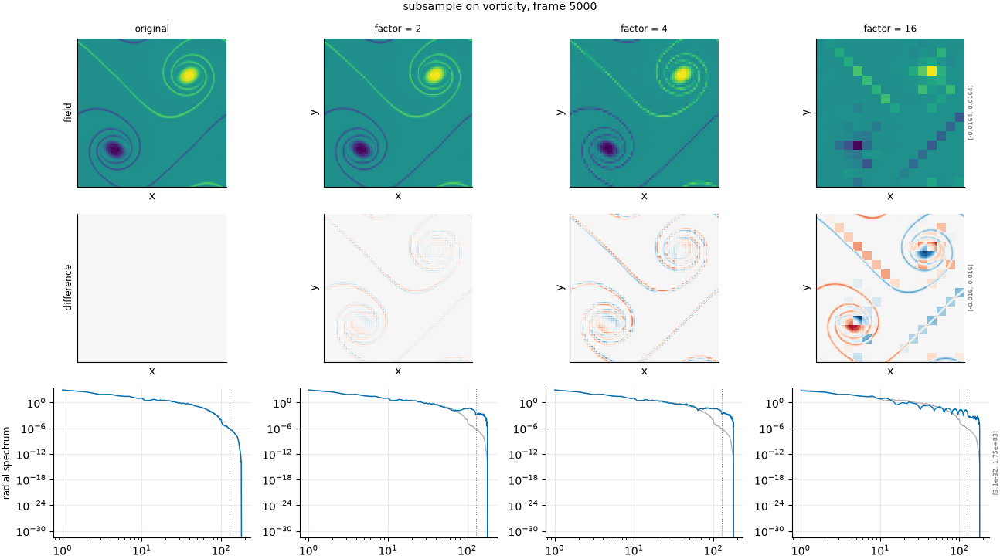

## Definition

Every $m$-th cell is kept and the rest discarded, then the retained values are
expanded back to the original grid by nearest-neighbour repetition:

$$
g_i = f_{\,m \lfloor i/m \rfloor} \tag{1}
$$

Equation (1) is point sampling, not averaging, and that is the entire distinction from
``coarsen``. Because no low-pass filter is applied first, energy above the new Nyquist
wavenumber is not removed but folded back into the resolved range as aliasing.

The spatial mean is not preserved: it becomes the mean of the retained samples, which
differs from the mean of the field by an amount that depends on where the sampling grid
happens to fall.

### Boundary handling

None needed: the sampling grid tiles the domain when the factor divides the grid
size, and no cell outside the retained set is consulted.

## Intuition

This stands in for a surrogate that has been downsampled carelessly -- decimated without
filtering first. It is the wrong way to lose resolution, and it is in the default set as
the counterexample to ``coarsen``, which is the right way.

The difference between them is aliasing. Block averaging removes the small scales; point
sampling folds them back into the large ones, so the coarse field contains structure that
was never there. A metric that scores these two the same at matched factor is not
distinguishing lost information from corrupted information, which is a meaningful failure.

```
before                 after (factor 2)
0 0 0 0                0 0 0 0
0 1 1 0                0 0 0 0
0 1 1 0                0 0 1 1
0 0 0 0                0 0 1 1
```

The feature has not merely coarsened -- it has moved. Point sampling picked up the block
at one corner of each sampling cell and repeated it, displacing the structure by up to a
cell and changing its apparent position.

What this degradation leaves untouched is the values themselves: every number in the
output appears in the input, unaveraged, so extremes survive where block averaging would
have softened them.

## Severity scale

The severity is the subsampling factor -- the spacing between retained cells -- and is
**absolute** rather than calibrated, matching ``coarsen`` so the two degradations are
directly comparable. The strengths are configured at 2, 4, 8 and 16.

The factor must divide the analysis grid size; larger factors that do not fit are dropped
before the run rather than silently doing something else.

This degradation is disabled in the default set of degradations. It is a control for the
coarsening degradation rather than a failure mode worth measuring on its own, and the set
of degradations is kept short.

## Limitations

Disabled by default, so a run will not include this operator unless asked.

The displacement that point sampling introduces is real and is not part of the failure
being imitated. Structures shift by up to half a sampling cell depending on where the grid
falls, so part of the damage measured here is displacement damage rather than resolution
damage -- which, in a suite whose central concern is that metrics over-punish
displacement, makes this degradation harder to interpret than it looks.

The unpreserved spatial mean is a second confound: a metric sensitive to the mean will
register a change that has nothing to do with the resolution question.

## What the degradation looks like

### The picture

<!-- GENERATED exemplars: written by `python -m fmeval.cards exemplars subsample`, do not edit -->



**subsample** on vorticity, frame 5000 of `kinet_re5e4`. The same factors as the coarsening axis, so the two panels can be read against each other. The radial spectrum row is the one that shows aliasing: energy that should have been removed appears at low wavenumber instead, which is exactly what block averaging avoids.

| configured | applied | difference RMS | power retained |
|---|---|---|---|
| 2 | 2 | 0.0006884 | 0.9968 |
| 4 | 4 | 0.001465 | 0.9928 |
| 16 | 16 | 0.002495 | 0.7644 |

<!-- END GENERATED exemplars -->

Compare against the ``coarsen`` panel at matched factor -- these two are designed to
be read together. The field rows look similar at a glance, both blocky, but the
subsampled one has its features slightly displaced and its extremes intact where the
averaged one has softened them.

The radial spectrum row is where the real difference appears. Block averaging shows a
clean cut with sidelobes; here energy appears at low wavenumbers that was not in the
reference at all, folded down from above the new Nyquist limit. That excess is aliasing,
and it is structure the field never had.

## References

\bibliography
