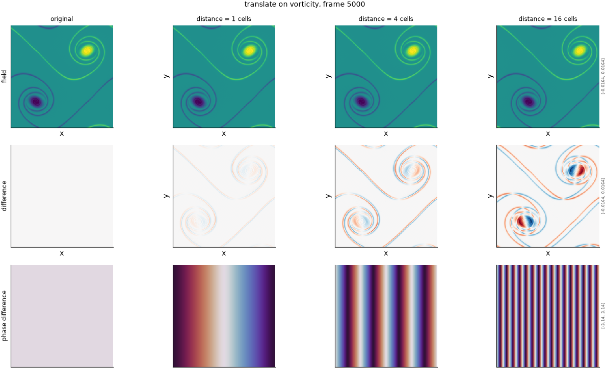

## Definition

The field is rolled by an integer number of cells $n$ along the chosen spatial direction,
or along both:

$$
g(x) = f(x - n\,\hat{e}) \tag{1}
$$

where $\hat{e}$ selects the direction, configurable as ``x``, ``y`` or ``diag``. The
severity is rounded to the nearest whole cell, so Equation (1) is an exact relabelling of
cells: no interpolation, no new values, and every value in the output appears in the
input.

In wavenumber space a translation multiplies each mode by $\exp(-i k \cdot n\hat{e})$.
The magnitude of every mode is therefore **exactly** unchanged and only the phase moves,
which is the precise sense in which this degradation is invisible to any metric built on
the amplitude spectrum alone.

### Boundary handling

Periodic wrap, and here it is exact rather than approximate: cells leaving one edge
re-enter at the opposite one, so the operation is a bijection on the grid and no
information is created or destroyed.

## Intuition

This stands in for the failure this whole repository is organised around: a surrogate that
gets a feature's shape and strength right and puts it in slightly the wrong place. A
predicted shock one cell to the left of the true one is, by any physical reading, a good
prediction. A metric comparing fields cell by cell scores it as two errors, one where the
shock should be and one where it is, and can rate it worse than a prediction with no shock
at all.

Applied to a picture, nothing changes except position. No feature softens, no contrast is
lost, no structure appears or disappears -- the entire image simply slides, and what
leaves one edge comes back at the other.

```
before                 after (shift 1 cell along x)
0 0 0 0                0 0 0 0
0 1 1 0                0 0 0 0
0 1 1 0                0 1 1 0
0 0 0 0                0 1 1 0
```

What this degradation leaves untouched is everything except position: every statistic that
does not depend on where things are -- the mean, the variance, the histogram of values,
the whole amplitude spectrum -- is preserved to the last bit. That is what makes this the
sharpest test in the default set.

## Severity scale

The severity is a displacement in whole analysis-grid cells and is **absolute**, not
calibrated: unlike the smoothing and spectral degradations, one cell means one cell on
density and on vorticity alike. That is deliberate -- displacement is the thing being
studied, and rescaling it per field would make the degradation incomparable between them.

The strengths run at 1, 2, 4, 8 and 16 cells, doubling each level so that a metric's
response can be read as a power law. Sixteen cells is roughly half the characteristic
scale of the vorticity field, which is where a shifted field stops resembling its
reference locally.

The direction is configurable: ``translate_x`` and ``translate_y`` are the same operator
with different options, and each becomes an independent entry in the configuration.

## Limitations

A whole-cell shift cannot test displacements smaller than one cell, which is exactly
where the interesting behaviour of the L^p family lives -- the damage MSE assigns at an
eighth of a cell is 55 times smaller than MAE's. Use ``translate_subpixel`` for that
range; this operator is the coarse companion.

A periodic translation is also a kinder failure than a real displacement error. A real
surrogate misplaces one feature while leaving others correct; this moves everything
together, so the field remains globally self-consistent in a way a genuinely wrong
prediction would not be. A metric that handles this well has not been shown to handle
selective displacement.

At large shifts on a periodic domain the field can come back into partial alignment with
itself if the flow has near-periodic structure, so damage is not guaranteed to keep rising
indefinitely with displacement.

## What the degradation looks like

### The picture

<!-- GENERATED exemplars: written by `python -m fmeval.cards exemplars translate`, do not edit -->



**translate** on vorticity, frame 5000 of `kinet_re5e4`. One cell is the smallest whole shift and is invisible by eye; sixteen is large enough that the field and its reference share little structure locally. The spectral phase row is the one that shows anything at all -- a translation leaves the amplitude spectrum exactly unchanged, so a radial spectrum panel would show two identical curves and teach the reader nothing.

| configured | applied | difference RMS | power retained |
|---|---|---|---|
| 1 | 1 | 0.0006502 | -- |
| 4 | 4 | 0.001864 | -- |
| 16 | 16 | 0.002758 | -- |

<!-- END GENERATED exemplars -->

The field row will look almost unchanged at one cell and obviously shifted at
sixteen; the eye is a poor judge here, which is the point. The difference row is more
useful: at a small shift it lights up only at feature edges, in the paired positive and
negative lobes that are the double penalty drawn as a picture.

The spectral phase row is the one to read carefully. A translation moves phase and leaves
amplitude untouched, so if a metric under test responds to this degradation it is using
phase information, and if it does not, it is amplitude-only. There is no radial spectrum
row here on purpose: it would show two identical curves at every severity, which is a true
statement about the degradation and a useless picture.

## References

\bibliography
