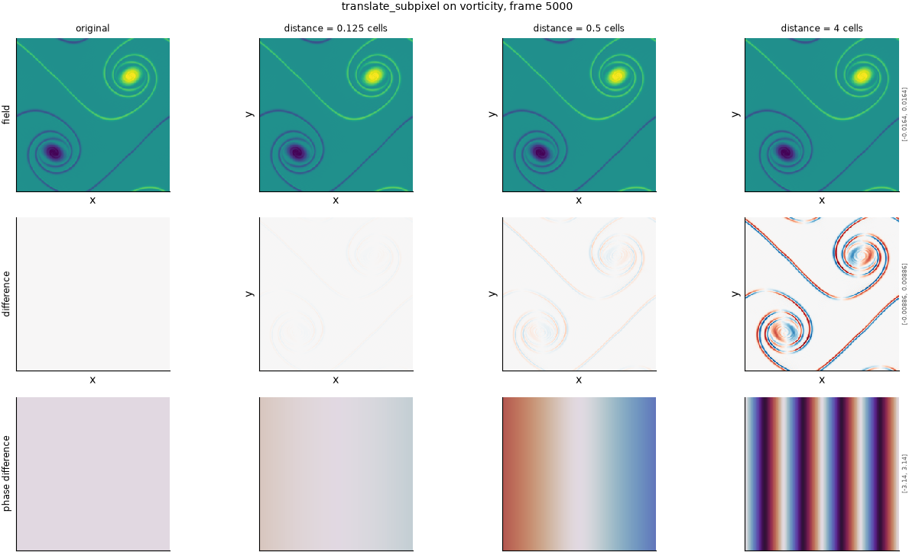

## Definition

The field is shifted by a real-valued displacement $\delta$ cells by multiplying its
discrete Fourier transform by a phase ramp,

$$
\hat{g}(k) = \hat{f}(k) \, \exp(-i k \delta) \tag{1}
$$

and transforming back, taking the real part. For integer $\delta$ Equation (1) reduces
exactly to a roll; for fractional $\delta$ it is the band-limited interpolation of the
field, which is the correct sub-cell shift for data that is periodic and fully resolved.

As with the whole-cell operator, the magnitude of every mode is unchanged and only phase
moves.

### Boundary handling

Periodic wrap, inherited from the Fourier transform itself: the discrete transform
assumes periodicity, so the shift wraps exactly and no edge treatment is needed or
possible.

## Intuition

This stands in for the same failure as the whole-cell translation -- a feature in slightly
the wrong place -- at the scale where it matters most for choosing between metrics. Below
one cell, the cell-by-cell error norms disagree enormously about how bad a small
displacement is: mean absolute error responds linearly and mean squared error
quadratically, so at an eighth of a cell one assigns 55 times the damage of the other. Any
claim that a metric is tolerant of small displacement has to be measured here.

A band-limited shift does something a whole-cell roll cannot: it produces values that were
not in the original field. Shifting the four-by-four test feature by half a cell gives

```
before                 after (shift 0.5 cells along x)
0 0 0 0                0    -0.21 -0.21  0
0 1 1 0                0     0.50  0.50  0
0 1 1 0                0     1.21  1.21  0
0 0 0 0                0     0.50  0.50  0
```

The negative values and the overshoot above one are real and are not a bug: they are the
ringing that any band-limited interpolation of a sharp edge produces. On a smooth,
well-resolved field they are small; on this deliberately sharp toy example they are large.

What this degradation leaves untouched is the amplitude spectrum, exactly, and the spatial
mean.

## Severity scale

The severity is a displacement in analysis-grid cells, continuous and **absolute**:
0.125 means an eighth of a cell on every field, with no per-field calibration, because
displacement is the quantity under study.

The strengths run at 0.125, 0.25, 0.5, 1.0, 2.0 and 4.0 cells -- six levels, each a
doubling, which is what allows a response to be read as a power law and its exponent
estimated. This is the longest sequence of strengths in the suite because it is the
degradation the project cares most about.

## Limitations

The ringing is the honest limitation. A band-limited shift of a field with genuine
discontinuities produces overshoot near them, so at large severities the operator is
doing something in addition to displacing: it is also adding oscillation. On the
well-resolved fields this suite uses the effect is small, but a metric that is sensitive
to spurious oscillation will register part of that as displacement damage.

The operator is also only correct for periodic, band-limited data. On a field with
significant energy at the Nyquist wavenumber the interpolation is not faithful, and on a
non-periodic field it would be wrong outright.

As with the whole-cell version, the whole field moves together, which is a more coherent
error than a real surrogate makes.

## What the degradation looks like

### The picture

<!-- GENERATED exemplars: written by `python -m fmeval.cards exemplars translate_subpixel`, do not edit -->



**translate_subpixel** on vorticity, frame 5000 of `kinet_re5e4`. An eighth of a cell is far below anything visible and is where the L^p family separates most sharply; four cells is well past the point where the shift is obvious. The spectral phase row is the only one that shows the mechanism, since a translation leaves the amplitude spectrum unchanged by construction.

| configured | applied | difference RMS | power retained |
|---|---|---|---|
| 0.125 | 0.125 | 8.36e-05 | -- |
| 0.5 | 0.5 | 0.0003321 | -- |
| 4 | 4 | 0.001864 | -- |

<!-- END GENERATED exemplars -->

At an eighth of a cell the field row is indistinguishable from the original by eye,
and that is the single most important thing this panel shows: the damage a metric assigns
at that severity is a claim about something no human can see, and the differences between
metrics there are enormous.

Read the difference row to find the change, which appears as thin paired lobes at every
feature edge, growing with severity. In the spectral phase row the ramp is visible as a
tilt that steepens with displacement, while the amplitude is untouched. A metric that does
not respond to this degradation at all is amplitude-only and cannot see displacement of
any size.

## References

\bibliography
